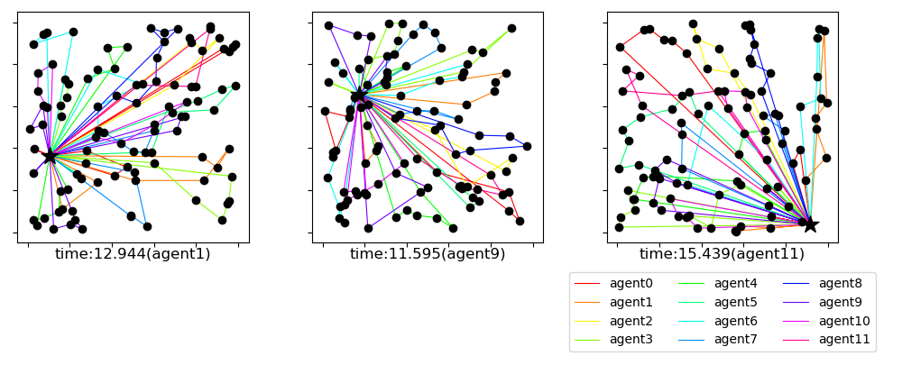

# C2ROM: A Chronological and Cooperative Route Optimization Method for Heterogeneous Vehicle Routing Problem
This repository contains a PyTorch implementation of an attention-based model for solving the Heterogeneous Vehicle Routing Problem (HVRP) with a min-max objective. The code is capable of handling arbitrary numbers of customers, vehicles, capacities, and speeds.



## Paper
For more detailed information, please refer to our paper titled "A Chronological and Cooperative Route Optimization Method for Heterogeneous Vehicle Routing Problem," which has been accepted at ICAI2023 - The 25th International Conference on Artificial Intelligence.

## Dependencies
- Python>=3.8
- NumPy
- SciPy
- Pytorch=1.12
- tqdm
- Matplotlib

## Usage
### 1. Generate data
Before start training or test, generate validation and test data.(Training data is generated on the fly.) :
```
python make_val_dataset.py
python make_test_dataset.py
```

### 2. Train
With a single GPU(e.g. V5-C80):
```
CUDA_VISIBLE_DEVICES=0 python train.py --n_custs 80 --n_agents 5
```
With multiple GPUs(e.g. with 2 GPUs):
```
CUDA_VISIBLE_DEVICES=0,1 python train.py --n_custs 80 --n_agents 5
```
For more detailed options:
```
python train.py --help
```
The training log (.csv) and checkpoint file (.pt) will be saved in the following directory: "results/{problem name}/{execution time}"

### 3. Test
To test greedy strategy:
```
python test.py path/to/hoge.pt
```
To test sampling strategy(e.g. with 1280 samples):
```
python test.py path/to/hoge.pt --n_sampling 1280
```
To test generalization ability in terms of customer size(e.g. with 200 customers):
```
python test.py path/to/hoge.pt --n_custs 200
```
The test results will be saved in the following directory: "results/{problem name}/{execution time}/test_e{epoch}"
